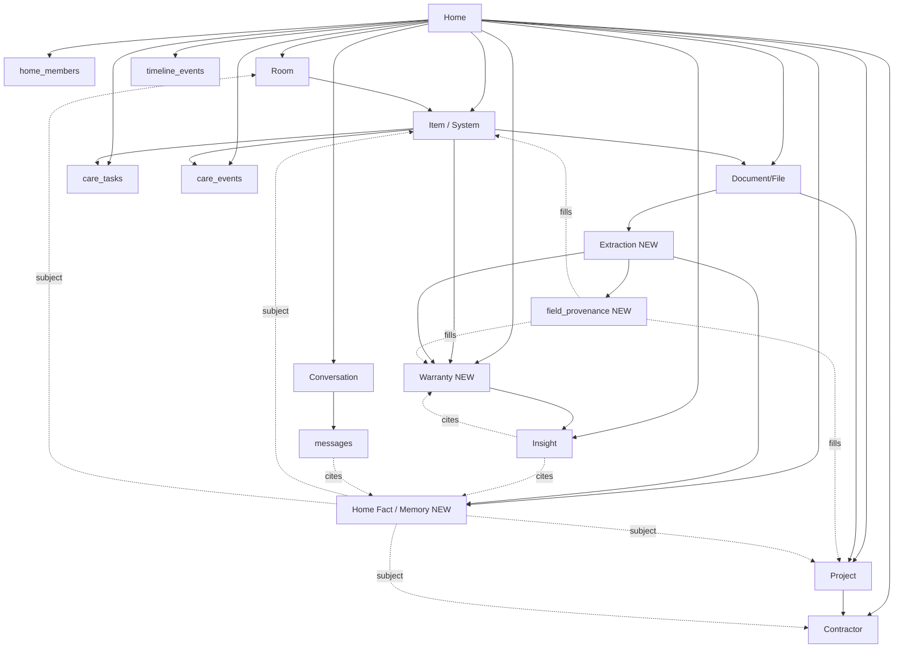

# HomeOS Phase 2, Knowledge-Graph Object Model

**Date:** 2026-07-12
**Scope:** The intelligence layer (Roadmap "Claude Prompt #1"). Defines every object HomeOS understands so ingestion, extraction, memory, citations, and proactive insights have a shared, buildable data model on the live Supabase schema.
**Ground truth:** `supabase/migrations/20260711200500_initial_schema.sql` (15 tables, all home-scoped, RLS via `is_home_member(home_id)`).

## How to read this doc

Every attribute is tagged against the live schema:

| Tag | Meaning |
|---|---|
| **EXISTING** | Column/table already in the live migration. Do not misrepresent it. |
| **NEW** | Proposed Phase 2 column or table. |
| **CHANGED** | Existing column whose meaning/usage shifts in Phase 2. |

Every attribute also has an **Origin**:

| Origin | Meaning | Provenance required? |
|---|---|---|
| **User** | Entered by a household member. | No (the user is the source). |
| **AI** | Generated by extraction or inference. | **Yes**, must carry source + confidence. |
| **System** | Assigned by the DB/app (ids, timestamps, defaults). | No. |

The provenance mechanism is defined once (next section) and reused by every AI-origin field in the catalog.

---

## 1. Provenance model (designed once, reused everywhere)

**Requirement:** every AI-generated field carries a source (document/extraction id) + confidence. Two object shapes need two patterns. Both share one `source_kind` vocabulary.

### `source_kind` enum (NEW)

| Value | Meaning |
|---|---|
| `user` | A household member typed it. |
| `extraction` | Parsed from a document via OCR + LLM (carries `extraction_id`). |
| `inference` | Reasoned by the model from other facts (no single doc source). |
| `seed` | Demo/seed data (matches existing `insights.source='seed'`). |

The live schema already ships this idea in two places: `care_tasks.source ('ai'|'user')` and `insights.source (default 'seed')`. Phase 2 generalizes it. `'ai'` maps to `extraction` or `inference`.

### Pattern A, Row-level provenance (whole object is AI-generated)

For objects where **the entire row** is a model output: `home_facts`, `insights`. Provenance lives in columns on the row itself:

| Column | Type | Purpose |
|---|---|---|
| `source_kind` | text | Which pattern produced it. |
| `confidence` | numeric (0–1) | Model confidence. |
| `source_extraction_id` | uuid null | The extraction it came from, if any. |
| `evidence` | jsonb | `[{kind, id}]` list when a claim cites multiple entities/docs. |

### Pattern B, Field-level provenance (object mixes user + AI fields)

For objects where **some columns are user-entered and some are AI-filled**: `items`, `projects`, `warranties`. A single polymorphic table records who filled each field. Absence of a row = user-authored (the default trust state).

**`field_provenance` (NEW table)**

| Column | Type | Notes |
|---|---|---|
| `id` | uuid pk | |
| `home_id` | uuid | RLS scope (denormalized so the standard policy applies). |
| `entity_table` | text | `items` \| `projects` \| `warranties` (checked set). |
| `entity_id` | uuid | The row filled. |
| `field` | text | Column name or json path (e.g. `model`, `facts.btu`). |
| `source_kind` | text | `extraction` / `inference`. |
| `extraction_id` | uuid null | FK → `extractions`. |
| `confidence` | numeric | 0–1. |
| `model` | text null | Model + version that produced it. |
| `created_at` | timestamptz | |

> **ponytail:** polymorphic `(entity_table, entity_id, field)` has no FK integrity, the accepted tradeoff for one reusable provenance table instead of per-column shadow columns on five tables. `home_id` keeps RLS intact. Upgrade path: split into per-entity tables only if referential integrity on provenance ever matters (it does not for a citation trail).

**Why two patterns, not one:** forcing `field_provenance` rows for wholly-AI objects (`home_facts`) would double every insert with no gain, since every field already shares one source. Forcing row-level columns onto `items` would lie about the user-typed fields. Each object uses the pattern that matches its authorship.

**Citation surface:** the Ask HomeOS answer blocks (`AnswerBlock` in `lib/ask-data.ts`) already model `warranty`, `cost`, `timeline`, `related` blocks. A cited answer resolves `home_facts.source_extraction_id` / `evidence` → the `files` row → a signed URL, so "HomeOS figured this out" links back to the actual receipt.

---

## 2. Object catalog

### 2.1 Home (`homes`), EXISTING table

The root node. Everything scopes to it.

| Attribute | Type | Tag | Origin |
|---|---|---|---|
| id, created_by, created_at, updated_at | uuid / ts | EXISTING | System |
| name, street, city, state, zip | text | EXISTING | User |
| year_built, sqft, beds, baths, property_type | int/numeric/text | EXISTING | User |
| features | jsonb `[]` | EXISTING | User |
| goals | jsonb `[]` | EXISTING | User |

**Relationships:** 1→N to every home-scoped table via `home_id`. Members via `home_members`.
**Lifecycle:** `created` → `active` (implicit; no status column, and none needed). Premium "Move Mode" (business plan) is a future flag, not Phase 2. **YAGNI: no new columns.** AI-derived home attributes (climate zone, inferred roof type) become `home_facts` with `subject_table='homes'`, not columns.
**AI vs user:** all columns user-entered at onboarding. **AI split:** none on the row; enrichment lives in facts.
**Example:** *Willow Lane*, "1959 colonial, 2,400 sqft, Minneapolis MN, goals: [reduce energy cost, prep for resale in 5yr]."

---

### 2.2 Room (`rooms`), EXISTING table

| Attribute | Type | Tag | Origin |
|---|---|---|---|
| id, home_id, created_at | uuid / ts | EXISTING | System |
| slug, name | text | EXISTING | User |
| summary | text | EXISTING | **AI** (currently seed/user; Phase 2 can auto-summarize from contained items) |

**Relationships:** `home_id` → home; N items reference `room_id`.
**Lifecycle:** `created` → `active` → (delete cascades items' `room_id` to null, preserving items).
**AI vs user:** name/slug user; `summary` becomes AI-generated (needs field-provenance if auto-filled). **CHANGED:** `summary` gains an AI origin path in Phase 2.
**Example:** "Basement, houses the water heater, furnace, and electrical panel."

---

### 2.3 Item / System (`items`), EXISTING table

Devices, appliances, systems, paint, exterior, yard, measurements. The most provenance-heavy object: users type some fields, extraction fills the rest.

| Attribute | Type | Tag | Origin | Provenance |
|---|---|---|---|---|
| id, home_id, created_at, updated_at | uuid / ts | EXISTING | System |, |
| room_id | uuid null | EXISTING | User |, |
| name, category | text | EXISTING | User |, |
| status | text | EXISTING | **AI** (health: excellent/good/watch/plan) | Pattern B |
| manufacturer, model, serial | text | EXISTING | **AI or User** | Pattern B when extracted |
| installed_on | date | EXISTING | **AI or User** | Pattern B when extracted |
| lifespan_years | int | EXISTING | **AI** (typical-life lookup) | Pattern B |
| summary | text | EXISTING | **AI** | Pattern B |
| facts | jsonb `[]` | EXISTING | **AI or User** (spec key/values, e.g. `{btu, capacity}`) | Pattern B per json path |
| knowledge | jsonb `[]` | **CHANGED** | AI/User freeform notes | superseded by `home_facts` |

**CHANGED, `items.knowledge`:** today a freeform string array (see `itemToLibraryItem` in `lib/library-data.ts`). Phase 2 routes new atomic notes to `home_facts` (embeddable, citable, cross-entity). The column stays for back-compat; no forced migration. **ponytail:** don't rewrite existing rows, dual-read (facts table + legacy jsonb) until the jsonb runs dry.

**Relationships:** `room_id` → room; referenced by `files.item_id`, `care_tasks.item_id`, `care_events.item_id`, `warranties.item_id` (NEW), and `home_facts.subject_id` (NEW).
**Lifecycle:**

```
draft (name only) → identified (manufacturer/model set)
  → active ──(status)──> watch → plan → replaced/retired
```

`status` transitions are AI-driven from age vs `lifespan_years` and service history (`overallHealth` heuristic in `lib/care-data.ts`). `replaced` is set when a replacement project completes.
**AI vs user split:** *User* = name, category, room, and any spec they know. *AI* = status/health, lifespan_years, summary, and manufacturer/model/serial/installed_on **when pulled from an uploaded manual or receipt** (each such fill writes a `field_provenance` row citing the extraction).
**Examples:**
- *Water heater:* User adds "Water heater" in Basement. Uploads the manual → extraction fills `manufacturer=Rheem`, `model=XE50T10`, `serial=...`, `lifespan_years=10`; user later sets `installed_on=2019-03`. `status='watch'` inferred (7 yrs old).
- *Roof:* `category=exterior`, `installed_on=2015-06`, `lifespan_years=25`, `status='good'`, `facts=[{material: architectural asphalt shingle}]` extracted from the inspection report.

---

### 2.4 Document (`files`), EXISTING table

The ingestion entry point. A file becomes intelligence only after extraction.

| Attribute | Type | Tag | Origin |
|---|---|---|---|
| id, home_id, created_at | uuid / ts | EXISTING | System |
| item_id, project_id | uuid null | EXISTING | User (or **AI** auto-link, Phase 2) |
| type | text (document/photo/video/receipt/manual/warranty) | EXISTING | User (or **AI** classify) |
| name | text | EXISTING | User |
| storage_path | text | EXISTING | System (`{home_id}/...` bucket) |
| meta | jsonb `{}` | EXISTING | System/User |
| taken_at | date | EXISTING | User/AI |
| `extraction_status` | text (none/pending/done/failed) | **NEW** | System |
| `content_hash` | text (SHA-256, unique per home) | **NEW** | System |

**NEW, `files.extraction_status`:** a cheap denormalized flag so the Library can show "processing…" / "processed" without joining `extractions`. Source of truth for detail stays in the `extractions` row.
**NEW, `files.content_hash`:** byte-level dedupe (intelligence-engine doc §3). Identical re-upload is caught at insert ("already in your library"), so the pipeline never double-processes or double-counts.

**Relationships:** `item_id` / `project_id` optional links; 1→N `extractions` (re-runs allowed, latest wins); source of `warranties.file_id` and `home_facts.source_extraction_id`.
**Lifecycle:**

```
uploaded → (type=receipt/manual/warranty/document/inspection) queued
  → extracting → extracted → linked (item/warranty/facts created)
  → [failed | needs_review]
```

Photos/videos skip extraction (status `none`) in Phase 2. **ponytail:** OCR-on-image and vision tagging is a later rung, not built now.
**AI vs user:** *User* = the upload, name, and often the item link. *AI* = `type` reclassification and auto item/project linking (both provenance-tracked as inferences).
**Example:** *Kitchen reno receipt*, user uploads `homedepot-2024-04.pdf`, tags `type=receipt`, links to the Kitchen Remodel project. Extraction produces vendor/total/line items (next object).

---

### 2.5 Extraction (`extractions`), NEW table

Structured data parsed from one document. One row per extraction run on a file (re-runs keep history; the newest `done` row is current). This is the bridge from raw file to typed knowledge.

| Attribute | Type | Tag | Origin |
|---|---|---|---|
| id | uuid pk | NEW | System |
| home_id | uuid | NEW | System (RLS, denormalized from file) |
| file_id | uuid → files | NEW | System |
| status | text (pending/processing/done/failed/needs_review) | NEW | System |
| doc_type | text (receipt/manual/warranty/inspection/insurance/other) | NEW | **AI** (classification) |
| raw_text | text | NEW | **AI** (OCR output) |
| data | jsonb | NEW | **AI** (structured fields, schema below) |
| confidence | numeric (0–1) | NEW | **AI** (overall) |
| model | text | NEW | System (model + version) |
| error | text null | NEW | System |
| search | tsvector (generated from raw_text) | NEW | System |
| created_at, updated_at | ts | NEW | System |

**`data` jsonb shape** (fields present depend on `doc_type`; each may carry its own confidence):
```json
{
  "vendor": "The Home Depot",
  "purchase_date": "2024-04-18",
  "total": 4240.15, "currency": "USD",
  "line_items": [{ "desc": "Shaker cabinet, white", "qty": 12, "amount": 2880.00 }],
  "model": "XE50T10", "serial": "RH19...", "manufacturer": "Rheem",
  "warranty_term_months": 72, "warranty_provider": "Rheem"
}
```

**Relationships:** N→1 `files`; referenced by `field_provenance.extraction_id`, `warranties.extraction_id`, `home_facts.source_extraction_id`. It is the hub every AI fact points back to for citation.
**Lifecycle:**

```
pending → processing → done
                    ↘ failed  (error set; retryable)
```

An extraction always lands `done` or `failed`. The human-in-the-loop gate is NOT an extraction status: individual low-confidence proposals (0.50–0.85) from a `done` extraction queue into the polymorphic `suggestions` table (intelligence-engine doc §2), the single review surface for every proposal type. No native dialogs, custom review cards (per project rules).
**AI vs user:** entirely AI-produced. A user can correct `data` in the review card; corrections flip the affected downstream field's provenance to `user`.
**Example:** *Kitchen reno receipt* → `doc_type='receipt'`, `data.total=4240.15`, 3 line items, `confidence=0.94`, `status='done'`. Downstream: project `spent` updated, facts minted, timeline entry created (the "receipt → everything" flow from the roadmap).

---

### 2.6 Warranty (`warranties`), NEW first-class table

**Decision: first-class table, extraction-derived when possible.**

Justification (one line each):
- **Independent lifecycle**, active → expiring → expired → claimed → void is real state the app must query and alert on; a `files.type='warranty'` string cannot hold dates or drive countdowns.
- **Proactive insights depend on it**, "your water heater warranty expires in 60 days" (a core pillar-2/pillar-4 behavior) needs `ends_on` as a queryable column, not text buried in a PDF.
- **Citable and standalone**, a warranty can exist with no file (user types "10-yr roof warranty") or one file can yield a warranty about an item; a first-class row with optional `file_id` and `item_id` models all three cases.
- **Not every warranty file is a warranty record and vice-versa**, the receipt (`type=receipt`) often *contains* the warranty; extraction promotes it to a `warranties` row regardless of the file's `type`.

| Attribute | Type | Tag | Origin |
|---|---|---|---|
| id, home_id, created_at, updated_at | uuid / ts | NEW | System |
| item_id | uuid null → items | NEW | User/AI (linked subject) |
| file_id | uuid null → files | NEW | User (source doc) |
| extraction_id | uuid null → extractions | NEW | System |
| provider | text | NEW | **AI or User** (Rheem, retailer, home-warranty co) |
| kind | text (manufacturer/extended/home-warranty/labor) | NEW | **AI or User** |
| coverage | text | NEW | **AI** (what's covered, summary) |
| starts_on, ends_on | date | NEW | **AI or User** |
| term_months | int null | NEW | **AI or User** |
| status | text (active/expiring/expired/claimed/void) | NEW | System/AI |
| confidence, source_kind | numeric/text | NEW | System (Pattern-B fields inline) |
| notes | text null | NEW | User |

**Relationships:** `item_id` → the covered item; `file_id`/`extraction_id` → provenance; feeds `insights` (expiry) and Ask `warranty` answer blocks.
**Lifecycle:**

```
active ──(ends_on - 60d)──> expiring ──(ends_on)──> expired
active/expiring ──(claim filed)──> claimed
any ──(user voids)──> void
```

`active/expiring/expired` are refreshed by a scheduled function comparing `ends_on` to `now()`. `claimed/void` are set by user/AI action. **ponytail:** derive-on-read would also work, but storing `status` lets insights filter with a plain index instead of date math on every query.
**AI vs user:** *AI* = provider/coverage/dates/term when extracted (field-provenance cites the extraction). *User* = manual entry, `notes`, and status overrides.
**Example:** *Water heater*, extraction of the Rheem manual creates `provider=Rheem`, `kind=manufacturer`, `term_months=72`, `starts_on=2019-03` (from item install), `ends_on=2025-03`, `status='expired'`, `confidence=0.9`. Drives a Worth-Knowing insight: "Water heater warranty lapsed in 2025, budget for replacement, no coverage remains."

---

### 2.7 Contractor (`contractors`), EXISTING table

| Attribute | Type | Tag | Origin |
|---|---|---|---|
| id, home_id, created_at | uuid / ts | EXISTING | System |
| name, company, phone, email, notes | text | EXISTING | User |

**Relationships:** referenced by `projects.contractor_id`. Phase 2: also cited by `home_facts` ("roof installed by ABC Roofing") and inferable from receipt `vendor`.
**Lifecycle:** `created` → `active`. No status column; **YAGNI: none needed.**
**AI vs user:** user-entered today. **NEW AI path:** extraction of a receipt/invoice can propose a contractor from `data.vendor` (an inference, provenance-tracked, surfaced as "add this contractor?", no silent insert).
**Example:** "ABC Roofing, 612-555-0134, installed roof 2015." The marketplace angle (roadmap Phase 3) builds on this seed; not Phase 2.

---

### 2.8 Project (`projects`), EXISTING table

| Attribute | Type | Tag | Origin |
|---|---|---|---|
| id, home_id, created_at, updated_at | uuid / ts | EXISTING | System |
| name | text | EXISTING | User |
| kind | text (active/idea/recommended/completed) | EXISTING | User (recommended → **AI**) |
| status, progress | text/int | EXISTING | User/AI |
| summary | text | EXISTING | User/**AI** |
| budget, spent, cost, value_added | numeric | EXISTING | User (spent/value → **AI**) |
| contractor_id | uuid null | EXISTING | User |
| started_on, target_end, completed_year | date/int | EXISTING | User |
| metadata | jsonb `{}` | EXISTING | User/**AI** (icon, tone, whyNow, benefits, see `lib/projects-data.ts`) |

**Relationships:** `contractor_id` → contractor; referenced by `files.project_id`; `spent` recalculated from linked receipt extractions; completion writes a `timeline_events` row (existing behavior).
**Lifecycle:**

```
idea ──> recommended (AI) ──> active (planning/scheduled/in-progress/on-hold) ──> completed
```

**AI vs user split:** *User* = name, budget, manual status. *AI* = `kind='recommended'` projects (generated from item age/inspection, with `metadata.basis` = "Based on system age" etc.), `spent`/`value_added` rollups from extractions, and `metadata.whyNow/benefits` copy. AI-written `spent` and `metadata.*` get field-provenance.
**Example:** *Kitchen remodel*, `kind='completed'`, `cost=42000`, `value_added=31000`, `spent` accumulated from 6 linked receipt extractions. *Recommended:* "Add attic insulation, Based on your climate, ~$1,800, ROI positive within 4 winters."

---

### 2.9 Maintenance Task (`care_tasks`), EXISTING table

| Attribute | Type | Tag | Origin |
|---|---|---|---|
| id, home_id, created_at | uuid / ts | EXISTING | System |
| item_id | uuid null | EXISTING | User/AI |
| title, detail | text | EXISTING | User/**AI** |
| priority | text | EXISTING | User/AI |
| season | text (spring/summer/fall/winter) | EXISTING | AI |
| due_on, recurrence | date/text | EXISTING | User/AI |
| status | text (open/done/snoozed) | EXISTING | User |
| completed_at, completed_by | ts/uuid | EXISTING | User/System |
| source | text (ai/user) | **EXISTING** | System (the original provenance flag) |

**Relationships:** `item_id` → item; completing a task can spawn a `care_events` row (service history).
**Lifecycle:** `open → done` / `open → snoozed → open`. Recurring tasks re-open on schedule.
**AI vs user split:** `source` already encodes it. *AI* tasks come from the maintenance scheduler reasoning over item age, season (Minneapolis climate in seed), and warranty/inspection facts. **CHANGED (semantic):** `source='ai'` maps to the new `source_kind` (`inference`); no column change required, the mapping lives in app code.
**Example:** AI task, "Flush the water heater (annual), sediment shortens tank life; due Oct 2026," `source='ai'`, `season='fall'`, `item_id`→water heater.

---

### 2.10 Service Event (`care_events`), EXISTING table

Immutable service-history log.

| Attribute | Type | Tag | Origin |
|---|---|---|---|
| id, home_id, created_at | uuid / ts | EXISTING | System |
| item_id | uuid null | EXISTING | User/AI |
| title, note | text | EXISTING | User/AI |
| cost | numeric | EXISTING | User/AI |
| occurred_on | date | EXISTING | User/AI |
| `project_id` | uuid null → projects | **NEW** | System/AI |

**NEW, `care_events.project_id`:** links receipt-derived spend to its project so `projects.spent` is recomputed as `sum(care_events.cost where project_id=…)` — idempotent by construction (intelligence-engine doc §3).
**Relationships:** `item_id` → item; `project_id` → project (spend rollup); surfaces in the item's maintenance history (`lib/library-data.ts`) and the Care activity feed.
**Lifecycle:** append-only; a past fact, no transitions.
**AI vs user:** *User* logs a service, or *AI* creates one from an extracted service invoice (provenance = the extraction). Feeds `home_facts` ("HVAC serviced by ABC on 2025-05").
**Example:** "HVAC tune-up, $180, ABC Heating, 2025-05-12", created from an uploaded invoice extraction.

---

### 2.11 Insight / Recommendation (`insights`), EXISTING table (Pattern A row-level provenance)

The proactive-intelligence object (Worth Knowing + Care insights). Wholly AI-generated → row-level provenance.

| Attribute | Type | Tag | Origin |
|---|---|---|---|
| id, home_id, created_at | uuid / ts | EXISTING | System |
| category | text | EXISTING | AI |
| headline, detail, basis, stat, action | text | EXISTING | **AI** |
| status | text (active/dismissed) | EXISTING | User (dismiss) / System |
| source | text (default 'seed') | **EXISTING/CHANGED** | maps to `source_kind` |
| `confidence` | numeric | **NEW** | AI |
| `evidence` | jsonb `[{kind,id}]` | **NEW** | AI (citations) |
| `source_extraction_id` | uuid null | **NEW** | System |

**NEW columns** add the missing provenance so an insight can cite the facts/docs it stands on (`basis` today is free text like "Based on system age"; `evidence` makes it a real link the UI can resolve).
**Relationships:** derives from `home_facts`, `warranties`, `items`; `action` links to Ask or a project.
**Lifecycle:** `active → dismissed`; `active → superseded` when the underlying facts change (re-generated). **NEW:** add `superseded` to the status check, or expire by recompute. **ponytail:** start by regenerating and dismissing stale ones; add a hard `superseded` state only if churn is noisy.
**AI vs user:** fully AI except the dismiss action.
**Example:** "Your roof is 11 years old, Based on system age and your climate, plan a replacement reserve." `evidence=[{kind:'item',id:roof},{kind:'fact',id:roof-age-fact}]`, `confidence=0.8`.

---

### 2.12 Timeline Event (`timeline_events`), EXISTING table

| Attribute | Type | Tag | Origin |
|---|---|---|---|
| id, home_id, created_at | uuid / ts | EXISTING | System |
| year | int | EXISTING | User/AI |
| title, detail | text | EXISTING | User/**AI** |
| kind | text (built/major/system/future) | EXISTING | AI |

**Relationships:** aggregates events from projects (completion mirrors here, see `lib/projects-data.ts`), item installs, and service history into the Home Timeline.
**Lifecycle:** append-only historical record; `future` entries are AI projections (e.g., "2030, roof replacement due").
**AI vs user:** *AI* generates `future` entries and can backfill install years from extractions; *User* adds milestones. AI entries provenance-tracked as inferences.
**Example:** "2015, Roof replaced (major)"; "2029, Water heater end-of-life (future, projected)."

---

### 2.13 Conversation & Message (`conversations`, `messages`), EXISTING tables

The Ask HomeOS transcript and answer store.

| Object | Key attributes | Tag | Origin |
|---|---|---|---|
| conversations | id, home_id, user_id, question, created_at | EXISTING | User |
| messages | id, conversation_id, role (user/assistant), content jsonb, created_at | EXISTING | User / **AI** |

**Relationships:** `messages.content` holds `AnswerContent` blocks (`lib/ask-data.ts`), which reference items/warranties/facts by id → the citation surface. Retrieval reads `home_facts` (embedding search) to ground answers.
**Lifecycle:** `conversation created → messages appended`. Assistant messages are AI; their citations resolve to provenance.
**AI vs user:** user messages user-origin; assistant messages AI with per-block evidence.
**Example:** Q "When should I replace my water heater?" → assistant `verdict` + `lifespan` + `warranty` + `cost` blocks, each citing the water-heater item, its facts, and the expired warranty.

---

### 2.14 Home Fact / AI Memory (`home_facts`), NEW table (Pattern A row-level provenance)

The atomic, citable knowledge unit and the RAG substrate. This is the "knowledge graph" node the business plan calls the long-term strategic asset. Every fact is one true statement about the home, embedded for semantic recall, with a source and confidence.

| Attribute | Type | Tag | Origin |
|---|---|---|---|
| id, home_id, created_at | uuid / ts | NEW | System |
| subject_table | text null (items/projects/rooms/homes/contractors) | NEW | System (polymorphic subject) |
| subject_id | uuid null | NEW | System |
| statement | text | NEW | **AI** (canonical NL claim, what gets cited + embedded) |
| predicate | text null | NEW | **AI** (optional slot, e.g. `paint_color`, `installed_on`, `serviced_by`) |
| object_value | text null | NEW | **AI** (value for structured facts) |
| category | text (spec/history/location/preference/financial) | NEW | AI |
| embedding | vector(1024) | NEW | System (Voyage `voyage-3` default; provider-swappable) |
| source_kind | text | NEW | System |
| source_extraction_id | uuid null → extractions | NEW | System |
| confidence | numeric (0–1) | NEW | AI |
| evidence | jsonb `[{kind,id}]` | NEW | AI (multi-source) |
| is_current | boolean default true | NEW | System (supersession) |
| superseded_by | uuid null → home_facts | NEW | System |

**Design decisions (one line each):**
- **Freeform `statement` + `embedding` is the primary path**; `predicate`/`object_value` are optional structured slots populated only when the extractor emits them. **ponytail:** don't force a triple store, most facts are a sentence and a vector; add structured slots opportunistically.
- **Embeddings via pgvector** (`create extension vector`), `vector(1024)` for Voyage `voyage-3` (Anthropic's recommended embedding partner), hnsw cosine index. Dimension is a one-line change if the provider changes.
- **Temporal memory** (`is_current` + `superseded_by`) makes memory *update* rather than accumulate contradictions, core to "a digital memory that gets smarter." A new "kitchen is now Simply White" fact supersedes the old color instead of both being retrieved.
- **Single polymorphic subject, no `fact_entities` link table yet.** **ponytail:** most facts are about one thing; if multi-subject recall proves necessary, add the join table then. `evidence` already handles multi-*citation*.
- **Supersedes `items.knowledge`** (CHANGED above): the generic, embeddable home for what was per-item freeform notes.

**Relationships:** optional `subject_*` → any core entity; `source_extraction_id` → the doc that proves it; read by Ask retrieval and Insight generation.
**Lifecycle:**

```
created (from extraction/inference) → current
current ──(newer contradicting fact)──> superseded (is_current=false, superseded_by set)
```

**AI vs user:** fully AI-generated. A user "correcting" the home simply mints a `user`-sourced fact that supersedes the AI one (highest trust).
**Examples:**
- *Spec:* "The water heater is a Rheem XE50T10, 50-gallon, installed March 2019." `subject=items:water-heater`, `predicate=model`, `object_value=XE50T10`, `source_kind=extraction`, `confidence=0.95`.
- *Location:* "The water main shutoff is in the basement near the furnace." `category=location`, `source_kind=user`.
- *History:* "The kitchen was remodeled in 2024 for about $42,000 by the homeowner." `subject=projects:kitchen`, `source_extraction_id`→receipt.

---

## 3. Relationship graph (everything hangs off the Home node)



**Read it as:** a **File** is ingested → produces an **Extraction** → which mints **Warranties**, **Home Facts**, and **field_provenance** rows that fill **Items/Projects** → those feed **Insights** and ground **Ask** answers, all of which cite back through provenance to the original File. That loop is the product (the roadmap's "receipt → warranty → cost → schedule → insight → Ask" flow), expressed as data.

---

## 4. Proposed migrations (ordered)

RLS pattern for every new home-scoped table = the existing one: `enable row level security` + a single `for all using (is_home_member(home_id)) with check (is_home_member(home_id))` policy (drop the table names into the existing `do $$ ... foreach` block in the initial migration's style).

```sql
-- 0. extension (embeddings)
create extension if not exists vector;

-- 1. files: cheap ingestion status flag + byte-level dedupe
alter table public.files
  add column extraction_status text not null default 'none'
    check (extraction_status in ('none','pending','done','failed')),
  add column content_hash text;
create unique index files_home_hash_idx on public.files (home_id, content_hash)
  where content_hash is not null;

-- 2. extractions: OCR + structured parse, one row per run
create table public.extractions (
  id uuid primary key default gen_random_uuid(),
  home_id uuid not null references public.homes(id) on delete cascade,
  file_id uuid not null references public.files(id) on delete cascade,
  status text not null default 'pending'
    check (status in ('pending','processing','done','failed')),
  doc_type text,
  raw_text text,
  data jsonb not null default '{}',
  confidence numeric,
  model text,
  error text,
  search tsvector generated always as (to_tsvector('english', coalesce(raw_text,''))) stored,
  created_at timestamptz not null default now(),
  updated_at timestamptz not null default now()
);
create index extractions_home_idx on public.extractions (home_id);
create index extractions_file_idx on public.extractions (file_id);
create index extractions_search_idx on public.extractions using gin (search);
create trigger extractions_updated_at before update on public.extractions
  for each row execute function public.set_updated_at();

-- 3. field_provenance: Pattern B (mixed user/AI objects)
create table public.field_provenance (
  id uuid primary key default gen_random_uuid(),
  home_id uuid not null references public.homes(id) on delete cascade,
  entity_table text not null check (entity_table in ('items','projects','warranties')),
  entity_id uuid not null,
  field text not null,
  source_kind text not null check (source_kind in ('extraction','inference')),
  extraction_id uuid references public.extractions(id) on delete set null,
  confidence numeric,
  model text,
  created_at timestamptz not null default now(),
  unique (entity_table, entity_id, field)
);
create index field_provenance_entity_idx on public.field_provenance (entity_table, entity_id);

-- 4. warranties: first-class, extraction-derived
create table public.warranties (
  id uuid primary key default gen_random_uuid(),
  home_id uuid not null references public.homes(id) on delete cascade,
  item_id uuid references public.items(id) on delete set null,
  file_id uuid references public.files(id) on delete set null,
  extraction_id uuid references public.extractions(id) on delete set null,
  provider text,
  kind text check (kind in ('manufacturer','extended','home-warranty','labor')),
  coverage text,
  starts_on date,
  ends_on date,
  term_months int,
  status text not null default 'active'
    check (status in ('active','expiring','expired','claimed','void')),
  source_kind text not null default 'user',
  confidence numeric,
  notes text,
  created_at timestamptz not null default now(),
  updated_at timestamptz not null default now()
);
create index warranties_home_idx on public.warranties (home_id);
create index warranties_item_idx on public.warranties (item_id);
create index warranties_ends_idx on public.warranties (ends_on);
create trigger warranties_updated_at before update on public.warranties
  for each row execute function public.set_updated_at();

-- 5. home_facts: atomic AI memory + embeddings (Pattern A)
create table public.home_facts (
  id uuid primary key default gen_random_uuid(),
  home_id uuid not null references public.homes(id) on delete cascade,
  subject_table text check (subject_table in ('items','projects','rooms','homes','contractors')),
  subject_id uuid,
  statement text not null,
  predicate text,
  object_value text,
  category text,
  embedding vector(1024),
  source_kind text not null default 'inference'
    check (source_kind in ('user','extraction','inference','seed')),
  source_extraction_id uuid references public.extractions(id) on delete set null,
  confidence numeric,
  evidence jsonb not null default '[]',
  is_current boolean not null default true,
  superseded_by uuid references public.home_facts(id) on delete set null,
  created_at timestamptz not null default now()
);
create index home_facts_home_idx on public.home_facts (home_id);
create index home_facts_subject_idx on public.home_facts (subject_table, subject_id);
create index home_facts_embedding_idx on public.home_facts
  using hnsw (embedding vector_cosine_ops);

-- 6. insights: add row-level provenance + engine dedupe
alter table public.insights
  add column confidence numeric,
  add column evidence jsonb not null default '[]',
  add column source_extraction_id uuid references public.extractions(id) on delete set null,
  add column dedupe_slug text;

-- 7. A-lite row provenance + engine keys (intelligence-engine doc §2, §3)
alter table public.care_tasks
  add column provenance jsonb not null default '{}',
  add column template_slug text;
alter table public.care_events
  add column provenance jsonb not null default '{}',
  add column project_id uuid references public.projects(id) on delete set null;
alter table public.timeline_events
  add column provenance jsonb not null default '{}';

-- 8. suggestions: the review queue (full DDL in intelligence-engine doc §2)
create table public.suggestions ( … );

-- 9. RLS: all new home-scoped tables use the standard member policy
--    (extractions, field_provenance, warranties, home_facts, suggestions)
--    add their names to the existing do $$ ... foreach array pattern.
```

**Migration notes / ponytail:**
- No `ingestion_jobs`/queue table, `extractions.status` is the job state; the queue is infra (Vercel function + retry), not schema.
- No document-chunk/embedding table, facts carry the embeddings; add chunk-level embeddings only if fact recall proves too coarse.
- No `fact_entities` link table, single polymorphic subject + `evidence` citations cover Phase 2.
- `items.knowledge` jsonb kept (dual-read), not migrated in a big bang.

---

## 5. Summary of decisions

| Decision | Choice | One-line justification |
|---|---|---|
| Warranty | **First-class `warranties` table**, extraction-derived | Needs its own lifecycle + queryable expiry dates to drive proactive alerts; can exist with no file. |
| AI memory | **`home_facts`**: atomic statement + `vector(1024)` embedding + intrinsic provenance + supersession | The citable RAG substrate and the real "knowledge graph" node; temporal supersession makes memory improve, not accumulate contradictions. |
| Provenance | **Two patterns, one vocabulary**: row-level columns for wholly-AI objects (`home_facts`, `insights`), `field_provenance` table for mixed objects (`items`, `projects`, `warranties`) | Matches each object's authorship without doubling inserts or lying about user-typed fields; every AI field resolves to a source + confidence. |
| Extraction | **`extractions`** table, one row per run, `data` jsonb + `raw_text` tsvector | Bridges raw file to typed knowledge and is the citation hub every fact points back to. |
| Embeddings | **pgvector**, Voyage `voyage-3` (1024), hnsw cosine — **schema now, pipeline later** | Column is nullable and cheap; the embedding fill + retrieval ships only when Ask's live-table context outgrows the token budget (Ask reads tables directly today, zero index maintenance). |
| Review queue | **`suggestions` table** (intelligence-engine doc §2) is the only human-confirm surface | One polymorphic queue for every proposal type; extraction status stays a pure machine state. |
| Cost benchmarks (`cost_ref`) | **Static data file in `lib/`, not a table** | Reasoning-playbook questions need regional replacement costs and recoup rates; it is reference data, not home data — no RLS, no migration, versioned in git. Promote to a table only if it grows regional granularity or an update cadence git can't serve. |
| Graph | **No generic node/edge tables** | The relational FKs already are the graph; the only genuinely new node type is `home_facts`. |
```
