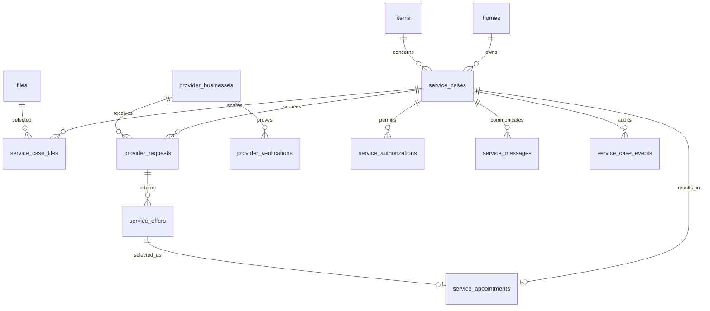

# GatheredOS Provider Coordination — Milestone A Specification

**Date:** July 15, 2026  
**Status:** A1–A6 implementation complete July 15, 2026; real-provider onboarding remains gated
**Pilot:** Twin Cities, invitation-only appliance repair, non-emergency cases  
**Parent brief:** Provider Availability and Coordination Blueprint confirmed July 15, 2026

## 1. Milestone objective

Prove that GatheredOS can turn a real appliance problem into a trusted,
homeowner-approved appointment while requiring less than ten minutes of the
homeowner's active attention.

Milestone A is intentionally an AI-assisted concierge. GatheredOS structures
the problem, prepares communications, normalizes provider responses, and
prepares the appointment. A trained operator handles external outreach and
exceptions behind the scenes. The product must not imply that unavailable
automation, integrations, provider qualifications, or appointment inventory
already exist.

### Exit decision

After 50 completed service cases, GatheredOS decides whether to:

1. proceed to provider response links and greater coordination automation;
2. revise the category, geography, provider cohort, or intake; or
3. stop marketplace investment because demand, trust, or unit economics do not
   support it.

## 2. Constitutional requirements

These are release blockers, not preferences.

- GatheredOS does not sell ranking or conceal commercial relationships.
- A provider is never described as verified without showing which facts were
  verified and when.
- General business hours are not presented as appointment availability.
- The homeowner approves the provider, scope, known price, appointment window,
  cancellation terms, shared information, and calendar impact before booking.
- The initial approval authorizes only the exact appointment presented.
- Agents and operators cannot silently expand the homeowner's authorization.
- Additional repairs, parts, charges, deposits, or changed terms require a new
  homeowner decision.
- All external communications and material state changes are auditable.
- Safety-critical symptoms leave the ordinary coordination flow and show the
  correct emergency or shutoff guidance.

## 3. Scope

### Included

- Start a repair request from an existing GatheredOS item.
- Collect symptoms, safety answers, photos, error codes, prior troubleshooting,
  homeowner scheduling preferences, and sharing consent.
- Generate a structured service brief from saved home records and new intake.
- Route safety-sensitive cases out of ordinary booking.
- Let an operator select and contact invited providers by phone, SMS, or email.
- Record provider questions, eligibility, fees, terms, and proposed windows.
- Present up to three normalized service options with transparent rationale.
- Capture explicit homeowner approval for one exact option.
- Let an operator book the appointment and record the confirmation.
- Add the confirmed appointment to Apple Calendar with EventKit after approval.
- Track cancellation, failure, completion, invoice, work performed, and warranty.
- Write the completed service back to the item's care history.
- Measure homeowner effort, provider response, booking, and completion.

### Excluded

- Open provider enrollment or public marketplace search.
- Provider mobile app or authenticated provider portal.
- Live provider-calendar availability.
- Automatic provider outreach without operator review.
- Autonomous booking, deposits, or repair authorization.
- GatheredOS-processed payments.
- Emergency dispatch.
- HVAC, plumbing, electrical, construction, remodeling, and insurance claims.
- Paid placement, lead auctions, invoice-percentage fees, and provider billing.

## 4. Personas and responsibilities

### Homeowner

Reports a problem, reviews information before it leaves the household, compares
options, approves a binding appointment, and confirms the service result.

### Household member

May contribute symptoms or availability. Only an owner or family member with
the `service_booking` permission may approve a booking. Guests may not approve.

### GatheredOS operator

Reviews the service brief, performs or supervises provider outreach, records
responses exactly, resolves ambiguity, confirms bookings, and manages
exceptions. Operators never recommend based on undisclosed compensation.

### Founding provider

Receives qualified appliance-repair requests, responds through its existing
workflow, states fees and terms, proposes appointment windows, and confirms or
declines the appointment. Pilot participation is free.

## 5. Core domain model

Milestone A adds service coordination as a separate domain. Do not overload
`care_tasks`, `care_events`, `projects`, or the existing household-owned
`contractors` table with marketplace workflow state.

### 5.1 `provider_businesses`

Network-level provider identity, independent of a household.

| Field | Purpose |
|---|---|
| `id` | UUID primary key |
| `legal_name` | Registered business name |
| `display_name` | Customer-facing business name |
| `website`, `phone`, `email` | Contact channels |
| `status` | `candidate`, `invited`, `active`, `paused`, `removed` |
| `pilot_market` | Initially `twin_cities` |
| `services` | Structured appliance and service capabilities |
| `brands` | Brands explicitly serviced; empty means unknown, not all |
| `service_area` | ZIP codes or structured geographic rules |
| `booking_modes` | `phone`, `sms`, `email`, `booking_link`, future API modes |
| `booking_url` | Provider-controlled booking link when available |
| `diagnostic_policy` | Typical fee and when it is credited |
| `cancellation_policy` | Provider-stated policy |
| `parts_labor_warranty` | Provider-stated default terms |
| `internal_notes` | Operator-only notes, never displayed verbatim |
| timestamps | Creation and update history |

### 5.2 `provider_verifications`

Atomic verification claims so the UI can state precisely what was checked.

| Field | Purpose |
|---|---|
| `provider_id` | Provider business |
| `kind` | `identity`, `insurance`, `license`, `manufacturer`, `service_area`, `contact` |
| `status` | `pending`, `verified`, `expired`, `failed`, `not_applicable` |
| `value` | Redacted or display-safe verification result |
| `source` | Registry, document, direct confirmation, or operator check |
| `verified_at`, `expires_at` | Freshness |
| `verified_by` | Operator or system actor |
| `evidence_path` | Private evidence location when applicable |
| `notes` | Internal qualification context |

One green badge may not collapse these claims into “trusted.” The homeowner
sees the relevant facts and dates.

### 5.3 `service_cases`

The durable coordination record.

| Field | Purpose |
|---|---|
| `id`, `home_id`, `item_id` | Scope the case to the household and item |
| `opened_by` | User who started it |
| `assigned_operator_id` | Current operations owner |
| `status` | Canonical state machine value |
| `service_category` | Initially `appliance_repair` |
| `urgency` | `routine`, `soon`, `safety_stop` |
| `symptom_summary` | Homeowner-confirmed problem statement |
| `structured_intake` | Versioned answers, error codes, prior actions, safety answers |
| `preferred_windows` | Homeowner availability and constraints |
| `service_address_snapshot` | Encrypted/controlled snapshot used for this case |
| `item_snapshot` | Immutable identity and evidence sent for this case |
| `safety_result` | Rule version, result, reasons, and recommended action |
| `sharing_status` | `not_requested`, `approved`, `revoked`, `expired` |
| `sharing_scope` | Exact fields and providers authorized |
| `sharing_expires_at` | Time-limited outreach authority |
| `resolution` | `booked`, `diy`, `warranty`, `no_supply`, `cancelled`, `failed` |
| timestamps | Opened, updated, closed |

### 5.4 `service_case_files`

Join table for the specific photos or documents approved for a case. A provider
must never receive every file linked to the item by default.

### 5.5 `provider_requests`

One outreach attempt to one provider.

| Field | Purpose |
|---|---|
| `service_case_id`, `provider_id` | Request relationship |
| `status` | `draft`, `approved_to_send`, `sent`, `viewed`, `responded`, `declined`, `expired`, `withdrawn` |
| `channel` | `phone`, `sms`, `email`, `booking_link` |
| `request_payload` | Exact approved content sent |
| `sent_by`, `sent_at` | Audit fields |
| `response_summary` | Operator-normalized response |
| `decline_reason` | Structured supply feedback |
| `source_message_id` | Link to communication record |

### 5.6 `service_offers`

Normalized, comparable provider responses.

| Field | Purpose |
|---|---|
| `provider_request_id` | Source request |
| `status` | `proposed`, `held`, `selected`, `expired`, `withdrawn`, `declined` |
| `service_fit` | Confirmed brands/appliances and limitations |
| `visit_type` | `diagnostic`, `estimate`, `repair_attempt` |
| `diagnostic_fee`, `travel_fee`, `deposit` | Known monetary terms |
| `price_notes` | What is and is not included |
| `window_start`, `window_end`, `timezone` | Proposed arrival window |
| `availability_source` | Provider statement, booking link, operator call, future API |
| `confirmed_at`, `expires_at` | Freshness and hold expiration |
| `cancellation_terms` | Terms shown before approval |
| `parts_labor_warranty` | Provider-stated terms |
| `provider_question` | Unresolved requirement blocking selection |

An offer with no `confirmed_at` cannot use “available” language.

### 5.7 `service_authorizations`

Append-only proof of homeowner consent.

| Field | Purpose |
|---|---|
| `service_case_id`, `user_id` | Subject and approver |
| `kind` | `share_request`, `book_appointment`, `reschedule`, `cancel` |
| `scope` | Exact provider, data, offer, fees, terms, and calendar action |
| `scope_hash` | Detect any post-approval mutation |
| `status` | `active`, `consumed`, `revoked`, `expired` |
| `expires_at` | Short-lived authorization |
| `approved_at`, `consumed_at` | Audit timestamps |

Booking fails closed if the offer or terms differ from the approved scope hash.

### Authority matrix

| Action | Homeowner | GatheredOS agent | Operator | Provider |
|---|---:|---:|---:|---:|
| Assemble saved item context | Review | Prepare | Review | No access |
| Run safety screen | Answer | Execute rules | Escalate | No access |
| Select shared evidence | Approve | Recommend minimum | Cannot expand | Receives selection |
| Contact approved providers | Authorize | Draft/route | Send in A | Respond |
| Normalize fees and windows | Review | Extract/compare | Verify in A | Supply facts |
| Select offer | Decide | Recommend | Cannot decide | Hold/confirm |
| Book appointment | Approve exact terms | Prepare | Submit in A | Confirm |
| Add Apple Calendar event | Approve in iOS | Prepare event | No access | No access |
| Authorize additional repair | Decide with provider | May explain | Cannot decide | Request directly |

### 5.8 `service_appointments`

| Field | Purpose |
|---|---|
| `service_case_id`, `provider_id`, `offer_id` | Booking context |
| `status` | `pending`, `confirmed`, `reschedule_requested`, `cancelled`, `completed`, `no_show`, `disputed` |
| `external_reference` | Provider confirmation or job number |
| `window_start`, `window_end`, `timezone` | Confirmed appointment |
| `confirmed_at`, `confirmed_by` | Proof of confirmation |
| `calendar_event_identifier` | EventKit identifier stored only after user action |
| `cancellation_terms_snapshot` | Terms that governed booking |
| `completion_summary` | Confirmed work result |

### 5.9 `service_messages`

Append-only communication ledger for homeowner, operator, provider, and system
messages. Store channel, direction, participants, delivery status, body or
redacted body, external ID, timestamps, and structured extracted facts.

### 5.10 `service_case_events`

Append-only state and audit ledger. Every transition records actor type, actor
ID, prior state, next state, reason, metadata, authorization ID, and timestamp.

### Relationship map



## 6. State machine

```text
draft
  → safety_screened
  → intake_ready
  → sharing_approved
  → sourcing
  → awaiting_provider_responses
  → options_ready
  → selection_approved
  → booking_pending
  → confirmed
  → service_underway
  → completed
  → recorded
```

Alternative terminal or recovery states:

- `safety_stopped`
- `diy_resolved`
- `warranty_routed`
- `no_qualified_provider`
- `no_availability`
- `slot_expired`
- `cancelled`
- `booking_failed`
- `disputed`

Transitions occur through server-side commands, never arbitrary client updates.
Each command validates the present state, household role, required evidence,
authorization, and idempotency key.

## 7. Authorization model

### Household roles

- `owner`: may share, book, reschedule, cancel, and authorize payment when added.
- `family`: may do the same unless a future household permission disables it.
- `guest`: may contribute intake but cannot authorize external commitments.
- `operator`: may prepare and execute only within an active homeowner scope.
- `provider`: has no household read access; receives case-specific snapshots.

### Consent sequence

1. Homeowner reviews the service brief.
2. Homeowner selects the information GatheredOS may share.
3. Homeowner approves outreach to named providers or a clearly defined maximum
   pool of invited providers.
4. GatheredOS creates a time-limited `share_request` authorization.
5. Operators may send only the approved snapshot.
6. Homeowner later approves one exact offer through a separate authorization.
7. The authorization is consumed once when the booking is submitted.

Revoking sharing stops new outreach and marks unsent provider requests
withdrawn. Previously delivered messages remain in the audit record.

## 8. Safety screening

Milestone A uses deterministic rules before generative guidance.

### Immediate stop examples

- Gas smell or suspected gas leak
- Smoke, fire, sparking, or burning wiring smell
- Electric shock or exposed energized wiring
- Active flooding near electricity
- Carbon monoxide alarm
- Appliance overheating with fire risk

The screen states why ordinary scheduling has stopped, provides the appropriate
emergency direction, and does not offer routine provider options. A model may
help interpret free text, but the stop decision and displayed instruction come
from a versioned safety rule set.

## 9. Homeowner iOS flow

All screens use native SwiftUI navigation, Dynamic Type, VoiceOver, semantic
colors, and 44-point minimum targets.

### Screen 1 — Get repair help

Entry from the item detail page. Shows known item identity and asks the
homeowner to describe the problem. The homeowner may add an error code, photos,
or voice-to-text description.

### Screen 2 — Safety check

Short, plain-language questions. Any stop condition replaces the ordinary flow
with safety guidance.

### Screen 3 — What GatheredOS knows

Shows manufacturer, model, serial, age, warranty, manual, service history, and
missing facts. The homeowner confirms or corrects the service brief.

### Screen 4 — Scheduling preferences

Collect two or more acceptable windows, urgency, access constraints, pets,
parking, tenant/household contact, and communication preference. Exact address
is not shared yet.

### Screen 5 — Review what will be shared

Lists every shared field and selected attachment. The default excludes serial
number, receipts, warranty documents, household notes, and unrelated files
unless they are required and explicitly selected.

Primary action: **Ask providers**. Supporting copy explains that no appointment
will be booked without another approval.

### Screen 6 — Coordination timeline

The case—not a chatbot—is the primary object. It shows meaningful states such
as “Service brief ready,” “Three providers contacted,” “Two responses,” and
“Options ready.” It does not expose chain-of-thought or theatrical agent work.

### Screen 7 — Compare options

Show up to three options in a comparable list. Each displays:

- provider and precise verification facts;
- why it fits;
- proposed or held arrival window;
- diagnostic, travel, and deposit amounts;
- price limitations;
- cancellation terms;
- warranty terms;
- availability confirmation time;
- whether fewer than three providers responded.

Recommended labels are “Best overall,” “Soonest confirmed,” and “Lowest known
visit cost.” A label appears only when the evidence supports it.

### Screen 8 — Confirm appointment

Native confirmation sheet with provider, scope, fees, arrival window, terms,
shared information, and calendar destination. The homeowner explicitly taps
**Confirm appointment**.

### Screen 9 — Booking pending or confirmed

Pending states remain pending until the provider confirms. On confirmation,
the app offers **Add to Apple Calendar** using EventKit. Calendar permission is
requested at this moment, not during onboarding.

### Screen 10 — After the visit

Collect outcome, work performed, cost, invoice, parts, labor warranty, provider
timeliness, and whether the problem is resolved. Create a `care_event` only
after the homeowner confirms the record.

## 10. Operations console

Milestone A extends `/admin` with a direct-URL-only service operations area.

### Queue views

- Safety review
- Intake ready
- Outreach due
- Awaiting provider response
- Provider question
- Options need review
- Selection approved / booking due
- Confirmation overdue
- Appointment today
- Completion follow-up
- Cancellation, failure, or dispute

### Case workspace

- Household-safe case summary
- Item and evidence snapshot
- Authorization status and expiration
- Provider eligibility and verification facts
- Outreach composer using approved templates
- Communication timeline
- Structured response entry
- Offer normalization and comparison preview
- Booking confirmation fields
- Escalation and supervisor review
- Full audit history

The console visibly blocks actions outside the active authorization. Operators
cannot paste arbitrary household data into provider messages without creating a
new homeowner-approved scope.

## 11. Communication templates

### Initial provider request

> GatheredOS is coordinating a non-emergency appliance service request for a
> homeowner in {{zip}}. Appliance: {{manufacturer}} {{model}}, {{item_type}}.
> Problem: {{symptom_summary}}. Safety screen: no emergency indicators reported.
> Do you service this model, and can you provide your diagnostic fee, earliest
> available arrival windows, cancellation terms, and any information you need?

The full street address is withheld until the homeowner selects an option unless
the provider must validate its service area and the homeowner approved sharing.

### Clarification to homeowner

> {{provider}} can help but needs to know {{question}}. Your answer will be
> shared only with this provider for this request.

### Option ready

> Two qualified providers responded. Their availability and known visit costs
> are ready to compare. Nothing has been booked.

### Booking request

> The homeowner approved {{window}} for the described diagnostic visit under
> the terms shown. Please confirm the appointment and provide the confirmation
> or job number. Additional work or charges require homeowner approval.

### Confirmation

> Confirmed with {{provider}} for {{window}}. Known visit cost: {{fees}}.
> Cancellation terms: {{terms}}. Repairs beyond the approved visit are not yet
> authorized.

Templates are versioned. Every sent message records its template version and
the exact rendered body.

## 12. Server commands and boundaries

Recommended command surface:

- `createServiceCase`
- `saveServiceIntake`
- `runSafetyScreen`
- `approveProviderSharing`
- `revokeProviderSharing`
- `createProviderRequest`
- `markProviderRequestSent`
- `recordProviderResponse`
- `createServiceOffer`
- `publishServiceOptions`
- `approveServiceOffer`
- `submitBookingRequest`
- `confirmServiceAppointment`
- `requestReschedule`
- `cancelServiceAppointment`
- `completeServiceCase`
- `recordServiceOutcome`

All mutations are server-side, state-aware, idempotent, and logged. iOS calls
authenticated API routes or server functions; it never receives service-role
credentials. Provider network tables are not directly readable through normal
household RLS.

## 13. Analytics event dictionary

### Homeowner funnel

- `service_help_started`
- `service_safety_screen_completed`
- `service_safety_stopped`
- `service_intake_completed`
- `service_sharing_reviewed`
- `service_sharing_approved`
- `service_sharing_revoked`
- `service_options_viewed`
- `service_option_selected`
- `service_booking_approved`
- `service_booking_confirmed`
- `service_booking_failed`
- `service_calendar_added`
- `service_completed`
- `service_outcome_recorded`
- `service_disputed`

### Supply and operations

- `provider_request_created`
- `provider_request_sent`
- `provider_request_responded`
- `provider_request_declined`
- `provider_offer_created`
- `provider_slot_expired`
- `operator_escalation_created`
- `appointment_provider_cancelled`
- `appointment_homeowner_cancelled`
- `appointment_no_show`

### Required properties

Use IDs and categorical metadata, not raw symptoms, addresses, message bodies,
or other sensitive content. Track case ID, market, appliance type, case state,
provider count, channel, latency, and outcome.

### Primary measures

- Median homeowner active minutes from start to confirmed appointment
- Time from approved sharing to first qualified response
- Time to options ready
- Options-to-booking conversion
- Confirmed-slot accuracy
- Appointment completion rate
- Provider response and acceptance rate
- Provider and homeowner cancellation rate
- Operator minutes per completed case
- Cost per completed case
- Homeowner trust score
- Provider lead-quality score

## 14. Pilot staffing and service levels

### Minimum team

- One operations owner responsible for all active cases
- One backup operator for coverage and quality review
- One product/engineering owner on call for workflow failures
- One founder/provider-success owner recruiting and interviewing providers

### Initial operating hours

Publish limited coordination hours, for example weekdays 8 a.m.–6 p.m. Central.
Requests outside the window are accepted and clearly state when coordination
will begin. Do not imply 24/7 service.

### Internal targets

- New-case acknowledgment: under five minutes during operating hours
- Safety escalation: immediate
- First outreach after sharing approval: under ten minutes
- First qualified response: under 30 minutes
- Options or honest supply shortfall: under two hours
- Booking submission after approval: under ten minutes
- Confirmation escalation: after 30 minutes without response

These remain internal until real performance supports a customer promise.

## 15. Provider onboarding checklist

- Verify business identity and authorized contact.
- Record service area and appliance categories.
- Record brands not serviced as well as brands serviced.
- Capture diagnostic, travel, cancellation, and warranty policies.
- Verify insurance and licensing where applicable.
- Record ordinary response channels and hours.
- Run one simulated request and response.
- Explain that GatheredOS sends qualified requests, not guaranteed work.
- Explain that rankings are not sold.
- Obtain consent to store and display the specific verification facts.
- Allow the provider to pause requests immediately.

## 16. Pricing research inside the pilot

Milestone A does not charge providers. Family-plan eligibility gates the
homeowner-facing pilot, with founder-granted access available for research.

After each completed case, research:

- homeowner value compared with calling providers directly;
- willingness to pay within a subscription versus per coordination;
- provider value of structured intake and reduced administrative work;
- provider willingness to pay for an operations product;
- whether any fee changes perceived neutrality or trust.

Do not publish a provider price until at least 15 provider interviews and enough
repeated usage exist to test a real value metric. The current `$99/location/mo`
concept is a research hypothesis, not a committed price.

## 17. Acceptance tests

### Trust and authorization

- A guest cannot approve outreach or booking.
- An operator cannot send a provider request without active sharing authority.
- A provider receives only the approved case snapshot and selected attachments.
- Changing a fee, time, provider, or term invalidates booking approval.
- A consumed, expired, or revoked authorization cannot be reused.
- The audit ledger reconstructs every external message and state transition.

### Safety

- Every defined safety-stop answer prevents routine sourcing.
- Ambiguous free text that includes a stop phrase reaches operator review.
- Safety copy does not recommend routine scheduling as the next action.

### Availability and booking

- General business hours never render as an available appointment.
- Expired offers cannot be selected.
- Unconfirmed slots use proposed or awaiting-confirmation language.
- Booking remains pending until an external confirmation is recorded.
- Duplicate submission with the same idempotency key creates one booking request.
- Calendar creation happens only after confirmation and EventKit permission.

### Data and completion

- Cancelling a case preserves its audit history.
- Completing service can create a homeowner-reviewed care event and link invoice.
- Provider performance metrics update from verified case outcomes, not reviews
  alone.
- Analytics contain no raw address, message body, serial number, or symptom text.

### UX and accessibility

- The entire homeowner flow supports Dynamic Type and VoiceOver.
- Critical meaning never relies on color.
- Every binding action identifies its consequence before confirmation.
- Loading, empty supply, one-response, expired-slot, offline, and error states
  provide an honest next step.

## 18. Implementation sequence

### A1 — Foundation

1. ~~Add service-domain migration and RLS boundaries.~~
2. ~~Implement state-transition and authorization services.~~
3. ~~Add seed-only founding-provider structure and verification facts.~~
4. ~~Add service analytics events.~~

Implemented in migrations `20260715030000_service_coordination_foundation.sql`
and `20260715032000_service_coordination_commands.sql`, with shared service
modules under `lib/service-coordination/`. The founding-provider seed is
intentionally empty until real businesses are contacted and verified.

### A2 — Homeowner intake

1. Add item-level “Get repair help.”
2. Build symptom, safety, evidence, and availability intake.
3. Build sharing review and consent.
4. Build service case timeline.

### A3 — Operations

1. Build `/admin/service-cases` queue and case workspace.
2. Add approved message templates and communication logging.
3. Add structured provider response and offer entry.
4. Add escalation and quality review.

### A4 — Options and approval

1. Build homeowner option comparison.
2. Build exact booking authorization.
3. Build pending and confirmed states.
4. Add EventKit calendar creation on iOS.

### A5 — Completion and pilot hardening

1. Build cancellation, failure, completion, and dispute paths.
2. Write confirmed service outcomes to care history.
3. Add funnel and operational dashboards.
4. Run security, RLS, accessibility, state-machine, and duplicate-booking tests.
5. Execute simulated cases before inviting real households.

### A6 — Provider availability pilot

1. Record expiring, attributable provider availability checks instead of claiming live inventory.
2. Require current contact, service-area, and insurance verification before outreach.
3. Match providers deterministically by service ZIP, supported manufacturer, and current capacity.
4. Require a passed simulated request and expose progress toward ten pilot-ready providers.
5. Keep provider operating notes and simulations private under service-role access.

Implemented in migration `20260715080000_provider_availability_pilot.sql`, the
provider readiness console, and sourcing eligibility enforcement. A provider is
pilot-ready only when all required evidence is current; adding a provider to the
registry alone never makes the provider eligible.

## 19. Milestone A release gate

Milestone A enters a real pilot only when:

- all authorization, safety, availability, and booking acceptance tests pass;
- at least ten providers are verified and have completed a simulated request;
- operator coverage and escalation ownership are explicit;
- no screen implies autonomous booking or live availability where none exists;
- cancellation, failure, data deletion, and audit export paths work;
- every external action is attributable to a homeowner authorization and actor;
- pilot terms, privacy language, provider participation terms, and operational
  disclaimers receive qualified legal review.
